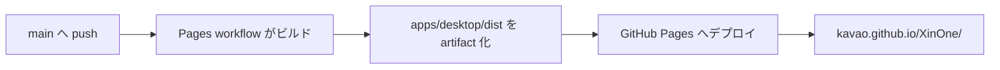

# GitHub Pages 公開

このガイドを読むと、XinOne の Web 版を GitHub Pages で公開できます。

## 公開 URL

リポジトリ `kavao/XinOne` の場合、次の URL で公開されます。

[https://kavao.github.io/XinOne/](https://kavao.github.io/XinOne/)

## リポジトリから Web 版へ誘導する

README 冒頭と GitHub Pages 節に Web 版 URL へのリンクを置いています。加えて、GitHub リポジトリ画面上からも次の設定ができます。

1. リポジトリトップ右上の **About** の歯車（⚙）を開く。
2. **Website** に `https://kavao.github.io/XinOne/` を入力して保存する。

About 横にリンクアイコンが表示され、README を開かなくても Web 版へ移動できます。

## 初回設定（リポジトリ管理者）

1. GitHub リポジトリの **Settings** → **Pages** を開きます。
2. **Build and deployment** の **Source** を **GitHub Actions** に設定します。
3. 設定を保存したあと、`main` ブランチへ push するか、Actions タブから **Deploy GitHub Pages** を **Re-run all jobs** で再実行します。
4. デプロイ完了後、**Settings** → **Pages** に表示される URL をブラウザで開きます。

> **注意**: Pages の Source を GitHub Actions に切り替える**前**に workflow が走ると、デプロイ job が 404 で失敗します（ビルドは成功します）。設定後に workflow を再実行してください。

## デプロイが 404 で失敗したとき

[Actions の Deploy ジョブ](https://github.com/kavao/XinOne/actions) で次のエラーが出る場合:

```text
Failed to create deployment (status: 404)
Ensure GitHub Pages has been enabled
```

次を確認してください。

1. **Settings → Pages → Source** が **GitHub Actions** になっている（Branch ではない）。
2. 設定変更**後**に workflow を再実行している（設定前の失敗 run をそのままにしない）。
3. リポジトリが Public である（Private リポジトリは Pages 利用に制限があります）。

確認後、Actions タブで失敗した **Deploy GitHub Pages** run を開き、右上の **Re-run all jobs** をクリックします。

## 自動デプロイの流れ



- ワークフロー定義: `.github/workflows/pages.yml`
- ビルド成果物: `apps/desktop/dist/`
- サブパス配信用の base URL は `VITE_BASE_PATH=/<リポジトリ名>/` で Vite に渡します。

## ローカルで Pages 向けビルドを確認する

GitHub Pages と同じ base URL でビルドし、プレビューします。

PowerShell:

```powershell
$env:VITE_BASE_PATH="/XinOne/"
npm run vite-build
npm run vite-dev
```

ビルド成果物だけ確認する場合は、`apps/desktop` で preview を起動します。

```powershell
$env:VITE_BASE_PATH="/XinOne/"
npm run vite-build
Set-Location apps/desktop
npx vite preview
```

## 注意事項

- GitHub Pages で公開されるのは **Web フロントエンドのみ** です。Tauri デスクトップ版の配布は別途 `npm run build` で行います。
- フルスクリーンはブラウザの Fullscreen API を使用します（Tauri 版とは実装が異なります）。
- リポジトリ名を変更した場合、`VITE_BASE_PATH` は workflow 内でリポジトリ名から自動設定されるため、workflow の修正は不要です。
