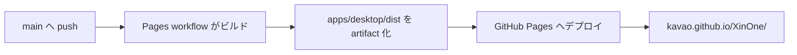

# GitHub Pages 公開

このガイドを読むと、XinOne の Web 版を GitHub Pages で公開できます。

## 公開 URL

リポジトリ `kavao/XinOne` の場合、次の URL で公開されます。

`https://kavao.github.io/XinOne/`

## 初回設定（リポジトリ管理者）

1. GitHub リポジトリの **Settings** → **Pages** を開きます。
2. **Build and deployment** の **Source** を **GitHub Actions** に設定します。
3. `main` ブランチへ push すると [Deploy GitHub Pages](https://github.com/kavao/XinOne/actions/workflows/pages.yml) ワークフローが実行されます。
4. デプロイ完了後、**Settings** → **Pages** に表示される URL をブラウザで開きます。

## 自動デプロイの流れ



- ワークフロー定義: `.github/workflows/pages.yml`
- ビルド成果物: `apps/desktop/dist/`
- サブパス配信用の base URL は `VITE_BASE_PATH=/<リポジトリ名>/` で Vite に渡します。

## ローカルで Pages 向けビルドを確認する

GitHub Pages と同じ base URL でビルドし、プレビューします。

PowerShell:

```powershell
$env:VITE_BASE_PATH="/XinOne/"
npm run vite-build
npm run vite-dev
```

ビルド成果物だけ確認する場合は、`apps/desktop` で preview を起動します。

```powershell
$env:VITE_BASE_PATH="/XinOne/"
npm run vite-build
Set-Location apps/desktop
npx vite preview
```

## 注意事項

- GitHub Pages で公開されるのは **Web フロントエンドのみ** です。Tauri デスクトップ版の配布は別途 `npm run build` で行います。
- フルスクリーンはブラウザの Fullscreen API を使用します（Tauri 版とは実装が異なります）。
- リポジトリ名を変更した場合、`VITE_BASE_PATH` は workflow 内でリポジトリ名から自動設定されるため、workflow の修正は不要です。
